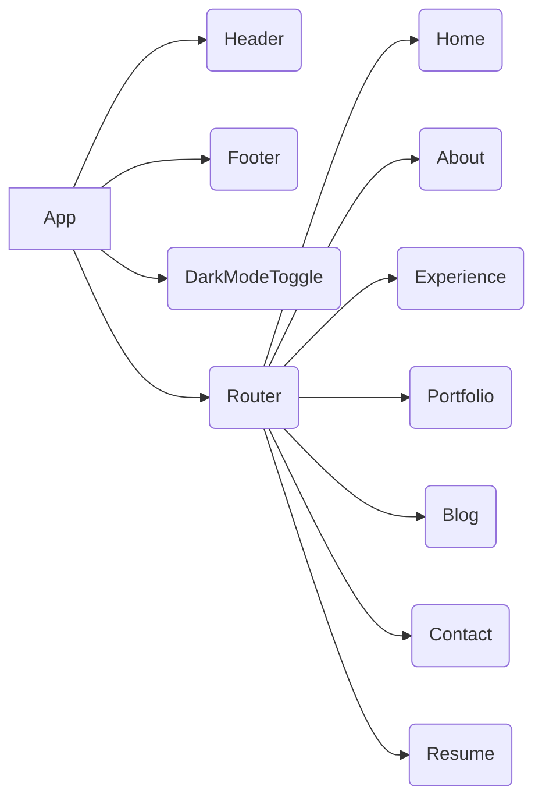
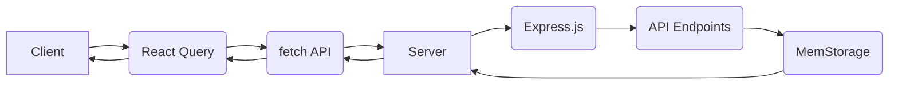
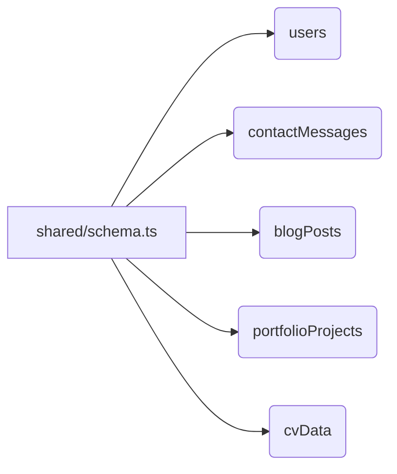

# Lochlann Website Architecture and Design

## 1. Project Architecture

The "lochlann" website is a React application built with TypeScript. It uses Tailwind CSS for styling and React Query for data fetching. The application uses `wouter` for routing. The server-side code is written in TypeScript using Express.js.

## 2. File Structure

The project follows a standard React file structure, with components organized in the `client/src/components` directory and pages in the `client/src/pages` directory. Data is stored in the `client/src/data` directory. The server-side code is located in the `server` directory.

## 3. Component Hierarchy

The main component is `App`, which wraps the entire application. It includes a `Header`, `Footer`, `DarkModeToggle`, and a `Router` component. The `Router` component defines the routes for the different pages of the website.

Here's a Mermaid diagram of the component hierarchy:



## 4. Design Patterns

The project uses a component-based architecture, with reusable components for different parts of the website. It also uses a data fetching library (React Query) to manage data fetching and caching. The server uses Express.js to handle API requests.

## 5. Key Components

*   `App`: The main component that wraps the entire application.
*   `Header`: The header component that displays the website title and navigation.
*   `Footer`: The footer component that displays copyright information and social media links.
*   `Router`: The component that defines the routes for the different pages of the website.
*   `Home`: The home page component.
*   `About`: The about page component.
*   `Experience`: The experience page component.
*   `Portfolio`: The portfolio page component.
*   `Blog`: The blog page component.
*   `Contact`: The contact page component.
*   `Resume`: The resume page component.

## 6. Data Flow

Data is fetched using React Query from the server-side API endpoints and displayed in the different components. The data is stored in the `client/src/data` directory. The server uses a `MemStorage` class to store data in memory.

## 7. Styling

Tailwind CSS is used for styling the components.

## 8. Server-Side Code

*   The server uses Express.js to handle API requests.
*   The `routes.ts` file defines the API endpoints.
*   The `storage.ts` file defines the `MemStorage` class, which is used to store data in memory.
*   The `index.ts` file is the main entry point for the server.
*   The `vite.ts` file configures Vite for serving static assets.

Here's a Mermaid diagram of the server-side architecture:

```mermaid
graph LR
    A[index.ts] --> B(routes.ts);
    A --> C(storage.ts);
    A --> D(vite.ts);
    B --> E[/api/contact];
    B --> F[/api/blog/posts];
    B --> G[/api/blog/post/:slug];
    B --> H[/api/portfolio/projects];
    B --> I[/api/cv];
    C --> J[MemStorage];
```

## 9. API Endpoints

*   `/api/contact`: Handles contact form submissions.
*   `/api/blog/posts`: Returns a list of blog posts.
*   `/api/blog/post/:slug`: Returns a specific blog post by slug.
*   `/api/portfolio/projects`: Returns a list of portfolio projects.
*   `/api/cv`: Returns CV data.

## 10. Client-Server Communication

*   The client uses React Query to fetch data from the server.
*   The `client/src/lib/queryClient.ts` file configures React Query and defines the `getQueryFn` function, which is used to fetch data from the server using the `fetch` API.
*   The `apiRequest` function is a helper function that makes API requests with the specified method, URL, and data.
*   The client sends HTTP requests to the server-side API endpoints.
*   The server responds with JSON data.

Here's a Mermaid diagram of the client-server communication:



## 11. Database Schema

*   The `shared/schema.ts` file defines the database schema using Drizzle ORM.
*   It includes schemas for users, contact messages, blog posts, portfolio projects, and CV data.
*   The schemas define the structure of the data that is stored in memory by the `MemStorage` class.

Here's a Mermaid diagram of the database schema:



## 12. Testing Strategy

*   The project does not have an explicit testing strategy defined.
*   There are no testing-related files in the project.